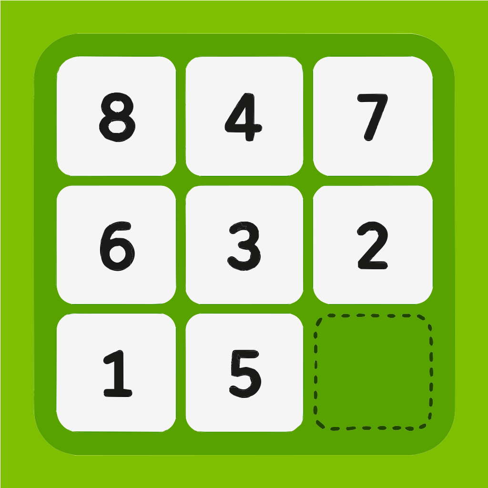
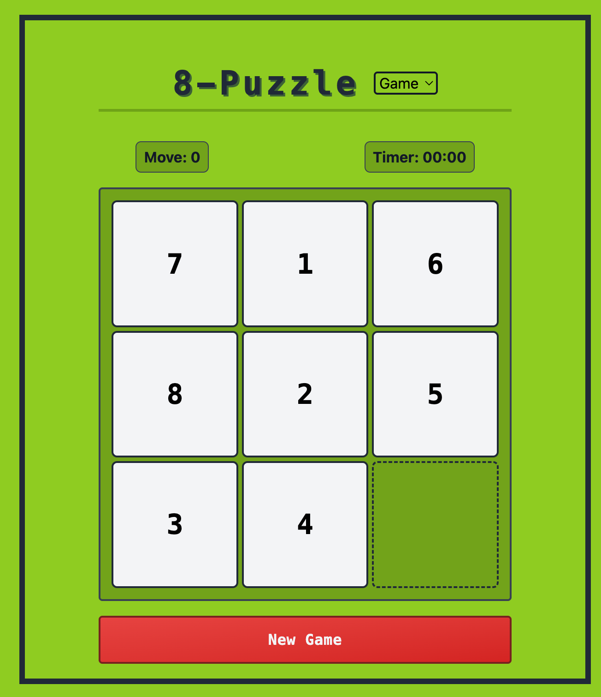

<div align="center">
  <div>
    <h1>&nbsp;&nbsp;8-puzzle</h1>
  </div>
  </ hr>
  <div>
    
  </div>
</div>

## Overview

This is a 8-puzzle (a 3×3 sliding‐tile puzzle) game built with React and TypeScript, and puzzle-solver using some algorithms such as BFS, greedy approach, and A\* algorithm.

## Demo

Here is a working live demo : [https://8-puzzle-nu.vercel.app](https://8-puzzle-nu.vercel.app/)

## Features

- **Two Play Modes**  
  Switch between Game mode (manual sliding) and Solver mode (algorithmic solutions).

- **Real-time Metrics**  
  Track your moves and elapsed time live as you play.

- **Multiple Solver Algorithms**  
  Watch BFS, Greedy, and A\* (with a Manhattan-distance heuristic) compute and animate solutions.

- **Responsive Design**  
  Enjoy seamless play on both desktop and mobile devices.

## Installation

1. Clone the repo

```bash
git clone https://github.com/toshi-0426/8-puzzle
cd 8-puzzle
```

2. Install the dependencies

```bash
npm install
```

3. Start the development server

```bash
npm run dev
```

4. Open your browser and navigate to `http://localhost:5173` (or whichever port) to start playing.

## References

The following resources were referenced for the solver implementation:

- **Solution to 8-Puzzle problems using the Best-First Search (BFS) Algorithm in Artificial Intelligence** by [Mahesh Huddar](https://www.youtube.com/watch?v=X88dBuZnBtA&t=34s)  
  A walkthrough of implementing a BFS-based solver for the 8-puzzle.

- **Solving 8 puzzle with A\* search** by [Jinyue Han](https://www.youtube.com/watch?v=GuCzYxHa7iA)  
  A detailed walkthrough of implementing A\* search with a Manhattan-distance heuristic, which inspired the solver logic in this project.

## Licence

This project is licensed under the MIT License.  
See the [LICENSE](./LICENSE) file for details.
